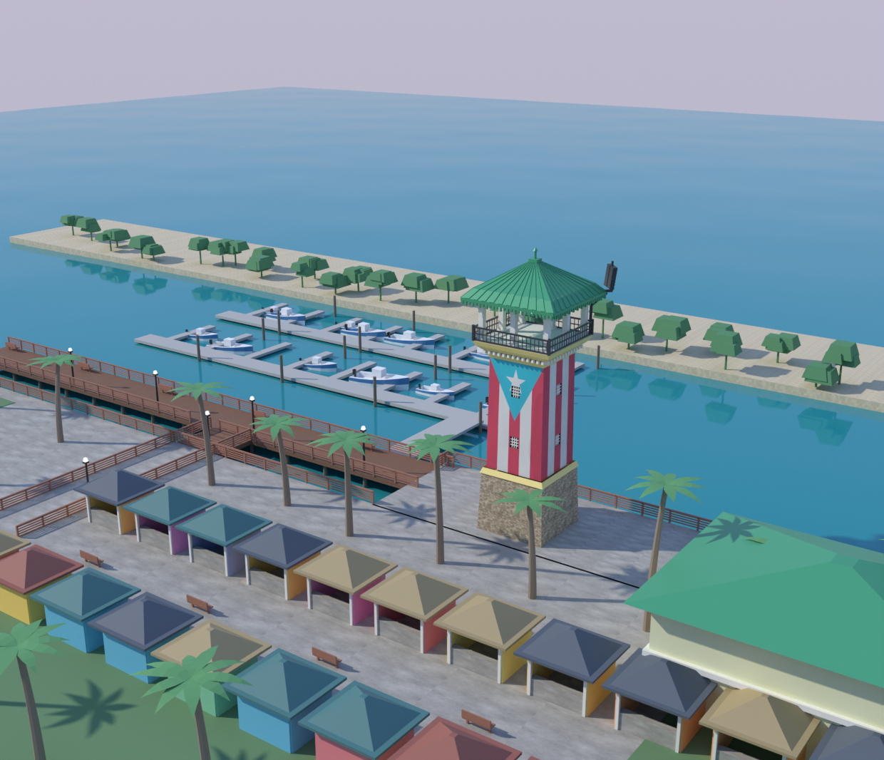
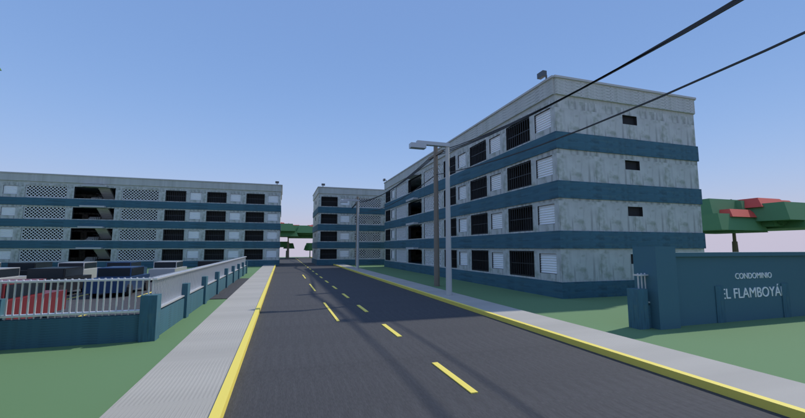

# Modelado 3D paramétrico — Puerto Rico

Reconstrucciones modeladas **por código** con Blender (`bpy`) a partir de
fotografías de referencia. Ninguna se dibujó a mano: toda la geometría se
genera desde un script, y las texturas se rasterizan por procedimiento.

| Escena | Qué es |
|---|---|
| **La Guancha** | El faro del Paseo Tablado y su complejo, en Ponce |
| **El Flamboyán** | Bloques de vivienda de cuatro plantas y su parcela |

---

# La Guancha — el faro y su complejo

Reconstrucción paramétrica del faro del **Paseo Tablado La Guancha** (Ponce,
Puerto Rico) y del complejo que lo rodea.




El modelo no se dibujó a mano: toda la geometría se genera desde `build.py`, y
las texturas (la bandera y la mampostería del zócalo) se rasterizan por
procedimiento. Cambiar un número en el diccionario `P` reconstruye el edificio
completo de forma consistente.

## Qué incluye

| Pieza | Descripción |
|---|---|
| Zócalo | Mampostería de piedra con puerta de arco de medio punto y respiradero |
| Fuste | Torre cuadrada con la bandera de Puerto Rico y ocho ventanucos con reja |
| Cornisa | Doble banda amarilla con hilera de canecillos |
| Mirador | Losa, antepecho y barandal metálico de balaustres |
| Templete | Ocho columnas con basa y capitel, más arquitrabe |
| Cubierta | Cuatro aguas con faldón acampanado, costillas de chapa, faja decorativa y remate |
| Sonido | Dos *line arrays* volados en la esquina (la torre funciona como anfiteatro) |

Altura total **21,6 m**; unidades en metros, origen en la base, eje Z hacia arriba.

## El complejo

Alrededor del faro se reconstruye el **Complejo Recreativo y Cultural La
Guancha**: el paseo tablado sobre pilotes con sus barandas de listones, farolas
y bancos; la dársena con dos líneas de muelles flotantes, pantalanes y lanchas
amarradas; los **24 kioscos** en dos hileras enfrentadas; el edificio de dos
plantas con cubierta verde; el anfiteatro al aire libre; la lengua de playa con
su arbolado, el césped y el aparcamiento.

El conjunto ocupa **194 × 148 m** y suma 25 384 caras en 57 objetos.

| Vista | |
|---|---|
| `complejo_conjunto` | panorámica tipo dron, como la foto de referencia |
| `complejo_darsena` | desde el agua, con las lanchas en primer término |
| `complejo_tablado` | a pie de paseo, mirando al faro |
| `complejo_kioscos` | los kioscos con la marina detrás |

### Sobre la exactitud de la planta

**No es un levantamiento topográfico.** El entorno de ejecución bloquea por
política de red tanto `nominatim.openstreetmap.org` como `overpass-api.de`, así
que no fue posible descargar la planta real (footprints de OpenStreetMap), y
tampoco hay acceso a la API de Google Maps. La disposición se deduce de la
fotografía de referencia; las cantidades y los elementos presentes (24 kioscos,
marina, anfiteatro, playa, ~33 acres, 900 plazas de aparcamiento) provienen de
la documentación pública del complejo. Las posiciones y dimensiones concretas
son una interpretación a escala verosímil.

Si en algún momento se dispone de acceso a Overpass, `entorno.py` está escrito
para que sustituir el diccionario `S` por geometría real sea un cambio acotado.

## Uso

```bash
pip install bpy                       # Blender como módulo de Python (3.11)

python3 tools/textures.py textures    # regenera las texturas procedurales

python3 models/guancha/build.py --render          # solo el faro
python3 models/guancha/build_scene.py --render    # el conjunto completo
python3 tools/make_web_viewer.py                  # visor autocontenido
```

Opciones de ambos scripts: `--render`, `--samples N`, `--res N`, `--out DIR`;
`build_scene.py` acepta además `--views conjunto,darsena,tablado,kioscos`.
Si faltan las texturas, `build.py` las genera solo.

## Estructura

```
models/guancha/build.py          geometría y materiales del faro
models/guancha/entorno.py        tablado, dársena, kioscos, playa y arbolado
models/guancha/build_scene.py    ensambla faro + entorno y saca las vistas
models/guancha/meshlib.py        primitivas, y muros con huecos sin booleanas
models/guancha/render_views.py   cielo, mar, cámaras y render con Cycles
tools/textures.py                bandera, piedra, tablado, hormigón y arena
tools/make_web_viewer.py         versión ligera autocontenida del visor
viewer/index.html                visor WebGL del .glb
exports/guancha.glb              solo el faro (texturas embebidas)
exports/guancha_complejo.glb     el conjunto completo
exports/renders/                 vistas renderizadas
reference/                       fotografía de referencia
```

> El módulo del entorno se llama `entorno.py` y no `site.py` porque este último
> nombre choca con el módulo `site` de la biblioteca estándar de Python.

## Compatibilidad de los archivos

| Archivo | Abre en |
|---|---|
| `exports/*.glb` | cualquier cosa: Blender 3.x+ (*File › Import › glTF 2.0*), Godot, Unity, Unreal, three.js, los visores de Windows y macOS, impresión 3D |
| `exports/*.blend` | **Blender 5.0 o superior**, y solo ahí |

Los `.blend` se generan con `bpy 5.0` y los archivos de Blender **no son
compatibles hacia atrás**: en Blender 4.x no abren. Si usas una versión
anterior, importa el `.glb`, que lleva la geometría, los materiales y las
texturas embebidas.

Ambos `.blend` se guardan ya montados —cielo, sol, cámara, Cycles y la gestión
de color— y con las vistas 3D en **Material Preview**. Esto último importa: si
se guardan con el sombreado de fábrica (*Solid*), Blender los abre mostrando
color plano y las texturas de imagen no se ven, aunque estén ahí. Parece que el
modelo viniera sin ellas.

## Detalles de implementación

**Muros con huecos sin booleanas.** Las operaciones booleanas de Blender son
frágiles en modo *headless*. En su lugar, `meshlib.wall_panels()` descompone
cada cara en franjas horizontales y emite solo los cuadriláteros macizos que
rodean cada hueco; el arco de medio punto se aproxima escalonando esas franjas.
El mismo escalonado se reutiliza para la mocheta, así que muro y jamba encajan
exactamente y la malla queda limpia y cerrada.

**La bandera.** Está pintada girada 90°: el izado ocupa el borde superior, las
cinco franjas caen verticales y el triángulo apunta hacia abajo. La estrella, en
cambio, se pintó recta. El atlas de textura lleva dos paneles —bandera completa
a la izquierda, solo franjas a la derecha— y las UV mandan el panel con
triángulo a las caras frontal y trasera, y el de franjas a las laterales,
reproduciendo lo que se ve en la foto. La profundidad del triángulo se calcula
para que siga siendo equilátero *en el mundo 3D*, no en el espacio de textura.

**Costillas de la cubierta.** Cada faldón se divide en franjas alternas
desplazadas 4,5 cm a lo largo de la normal del paño, lo que produce el perfil de
chapa engatillada sin geometría adicional.

**La dársena no se excava.** Es el hueco que queda entre la tierra principal, al
norte, y la lengua de playa, al sur; el agua simplemente asoma entre ambas. Sale
más barato y más robusto que restar volúmenes.

**Cascos lofteados.** Cada lancha se genera interpolando seis cuadernas, con la
regala subiendo hacia la proa y la bañera rehundida a popa de la consola. Con
esas tres líneas —cuaderna, regala y pantoque— una caja pasa a leerse como un
barco.

---

# El Flamboyán — bloques de vivienda



Walk-up de cuatro plantas en hormigón visto pintado, del tipo que puebla los
condominios y residenciales de Puerto Rico. Lo que define esta arquitectura no
es la forma sino cinco rasgos concretos, y el modelo los lleva todos:

| Rasgo | En el modelo |
|---|---|
| **Celosías de bloque ornamental** | Retícula de rombos, un aspa por celda |
| **Ventanas de persiana** ("Miami") | Lamas horizontales inclinadas 24° |
| **Bandas turquesa** en el canto del forjado | Hacen también de pretil del balcón |
| **Escalera exterior abierta** | Dos tiros por planta, con meseta y barandilla |
| **Balcones con reja** | Recogidos 1,15 m, barrotes verticales |

Cuatro bloques sobre la parcela, con vial de acceso, aparcamiento, verja
perimetral, el muro del rótulo, alumbrado, tendido aéreo y arbolado —
flamboyanes incluidos, que es de donde viene el nombre.

**443 objetos visibles y 56 875 caras, pero solo 47 geometrías distintas**: el
bloque se modela una vez y se replica, y dentro de él celosías, persianas,
rejas y coches son duplicados enlazados que comparten malla.

```bash
python3 models/flamboyan/build_scene.py --render
```

| Vista | |
|---|---|
| `flamboyan_entrada` | a pie de calle desde la entrada, como la foto de referencia |
| `flamboyan_conjunto` | panorámica de la parcela |
| `flamboyan_bloque` | un bloque de cerca: celosías, persianas y escalera |
| `flamboyan_patio` | el aparcamiento tras la verja |

### Dos fallos que costaron encontrar

**Los bloques se colocaban dos veces.** `instance_group` deja las copias ya en
coordenadas de mundo; al emparentarlas además a un vacío que llevaba la misma
traslación y giro, el bloque acababa desplazado y rotado el doble. La inversa
del padre no lo corregía porque `matrix_world` aún no estaba actualizado.

**Las celosías desaparecían.** Mismo origen: `instance_group` leía
`matrix_world` de los duplicados antes de que el depsgraph reflejara el
emparentado, y los colocaba todos en el origen. Hace falta un
`view_layer.update()` antes de instanciar — y no ocultar las mallas maestras
hasta después de haberlas copiado.

---

## Código compartido

Las dos escenas se apoyan en los mismos módulos, en `models/`:

```
models/meshlib.py       primitivas, muros con huecos, instanciado
models/matlib.py        materiales Principled con textura y normales
models/vegetacion.py    palmas, arbolado y flamboyanes
models/render_views.py  cielo, sol, cámaras, Cycles y gestión de color
tools/textures.py       todas las texturas, en PNG y sin dependencias
```

## Licencias

Ambos son edificios reales; estos modelos son interpretaciones propias hechas a
partir de fotos, y no reproducen planos. Las fotografías de referencia se
guardan en `reference/` solo como documentación del proceso: la del faro es de
**@khrizrivera**; la del condominio procede de una vista de calle.
