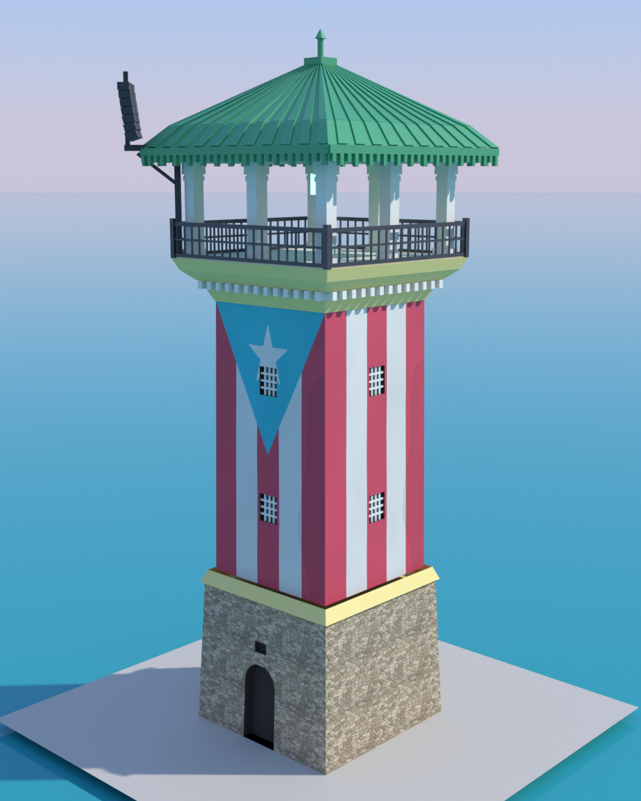

# Faro de La Guancha — modelo 3D

Reconstrucción paramétrica del faro del **Paseo Tablado La Guancha** (Ponce,
Puerto Rico), modelada por código con Blender (`bpy`) a partir de una
fotografía de referencia.



El modelo no se dibujó a mano: toda la geometría se genera desde `build.py`, y
las texturas (la bandera y la mampostería del zócalo) se rasterizan por
procedimiento. Cambiar un número en el diccionario `P` reconstruye el edificio
completo de forma consistente.

## Qué incluye

| Pieza | Descripción |
|---|---|
| Zócalo | Mampostería de piedra con puerta de arco de medio punto y respiradero |
| Fuste | Torre cuadrada con la bandera de Puerto Rico y ocho ventanucos con reja |
| Cornisa | Doble banda amarilla con hilera de canecillos |
| Mirador | Losa, antepecho y barandal metálico de balaustres |
| Templete | Ocho columnas con basa y capitel, más arquitrabe |
| Cubierta | Cuatro aguas con faldón acampanado, costillas de chapa, faja decorativa y remate |
| Sonido | Dos *line arrays* volados en la esquina (la torre funciona como anfiteatro) |

Altura total **21,6 m**; unidades en metros, origen en la base, eje Z hacia arriba.

## Uso

```bash
pip install bpy                       # Blender como módulo de Python (3.11)

python3 tools/textures.py textures    # regenera las texturas procedurales
python3 models/guancha/build.py       # genera .blend y .glb
python3 models/guancha/build.py --render --samples 140   # además, renderiza
```

Opciones de `build.py`: `--render`, `--samples N`, `--res N`, `--out DIR`.

## Estructura

```
models/guancha/build.py          geometría y materiales del faro
models/guancha/meshlib.py        primitivas, y muros con huecos sin booleanas
models/guancha/render_views.py   cielo, mar, cámaras y render con Cycles
tools/textures.py                bandera y piedra en PNG, sin dependencias
viewer/index.html                visor WebGL del .glb
exports/guancha.glb              modelo exportado (texturas embebidas)
exports/guancha.blend            escena de Blender
exports/renders/                 vistas renderizadas
reference/                       fotografía de referencia
```

## Detalles de implementación

**Muros con huecos sin booleanas.** Las operaciones booleanas de Blender son
frágiles en modo *headless*. En su lugar, `meshlib.wall_panels()` descompone
cada cara en franjas horizontales y emite solo los cuadriláteros macizos que
rodean cada hueco; el arco de medio punto se aproxima escalonando esas franjas.
El mismo escalonado se reutiliza para la mocheta, así que muro y jamba encajan
exactamente y la malla queda limpia y cerrada.

**La bandera.** Está pintada girada 90°: el izado ocupa el borde superior, las
cinco franjas caen verticales y el triángulo apunta hacia abajo. La estrella, en
cambio, se pintó recta. El atlas de textura lleva dos paneles —bandera completa
a la izquierda, solo franjas a la derecha— y las UV mandan el panel con
triángulo a las caras frontal y trasera, y el de franjas a las laterales,
reproduciendo lo que se ve en la foto. La profundidad del triángulo se calcula
para que siga siendo equilátero *en el mundo 3D*, no en el espacio de textura.

**Costillas de la cubierta.** Cada faldón se divide en franjas alternas
desplazadas 4,5 cm a lo largo de la normal del paño, lo que produce el perfil de
chapa engatillada sin geometría adicional.

## Licencias

El faro es una obra pública real; este modelo es una interpretación propia
hecha a partir de una foto y no reproduce planos. La fotografía de referencia en
`reference/` es de **@khrizrivera** y se guarda solo como documentación del
proceso.
